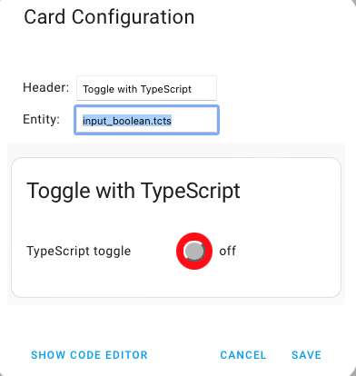
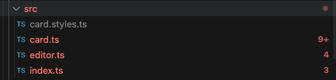
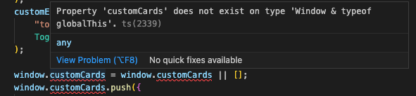
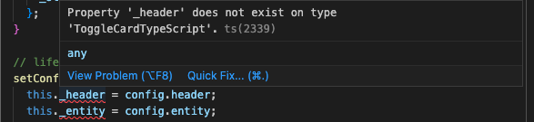
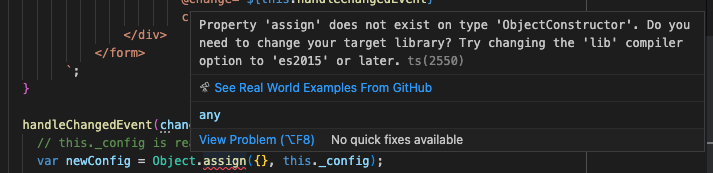

[](https://github.com/hacs/integration)

# Toggle Card With TypeScript

Migration to TypeScript

***

* @published: June 2023
* @author: Elmar Hinz
* @name: `toggle-card-typescript`
* @id: `tcts`

You learn:

* how to install the required tools for *TypeScript*
* how to set up the configuration files
* how to migrate the code to TypoScript
* how to enrich the code with typing
* how to import some interfaces for custom card development

## Goal

Migrating the sources from *JavaScript* to *TypeScript* and applying it.

## Prerequisites

* previous tutorial to build upon (tutorial 09)
* adding entities, cards and resources (tutorial 04, 02)
* setting up the core developers container (tutorial 01)
* setting up an npm based project (tutorial 08)
* basic experiences with *Lit* (tutorial 09)

Find all sources inside the `src/` folder!

## About TypeScript

Do you expect feedback from your editor? Do you expect suggestions for
properties and functions of an object? Is it useful, when the editor warns you
about mismatching types? Do you want to have a context menu, that leads you to
definition or source of the class of the object under the cursor? The editor has
to know the type of the content of a variable to perform this services.

Unfortunately *Javascript* is a dynamic typing language for historical reasons.
It is determined at runtime which type a variable will get, not at editing time.
In a time when editors didn't have much auto completion, it was handy not write
a lot of static types. Most users were beginners and didn't know much about
types at all.

*TypeScript* is a syntax extension to *JavaScript* that adds static typing. At
time of editing the editor knows about the type of a variable. It can assist you
as expected with suggestions and error detection.

The cost is you need to transpile *TS* into *JS* before being able to run it.
You need to mange a tool to do so. *TypeScript* has been developed by Microsoft
just like the *VS Code* editor. Both are neatly integrated and there is few
setup required for this editor.

## Usage

This tutorial is done in form of a protocol of the migration to
*TypeScript*. I mainly write in the first person therefore. You have several
choices of how to follow along. Refer to the [chapter about possible
usages](https://github.com/home-assistant-tutorials/08.toggle-card-with-toolchain#usage)
in *tutorial 08* which did take a similar approach.

## Preparing the project

I create the project folder, copy `hacs.json`, `.gitignore`, `package.json` from
*tutorial 09*. I need to update the `name` property in `hacs.json`. Next I copy
the `src/` folder. All types of identifiers like class names etc. are renamed
to match the current tutorial.

I run `npm install` to install the libraries. I run `npm run watch`, create the
toggle `tcts`, add the new resource
`/local/tutor/10.toggle-card-typescript/dist/card.js` and add the card to the
dashboard.



## First steps

I start by changing the filename extensions from `.js` to `.ts` within the
`src/` folder.



*VScode* is counting errors for some files. Without any setup *TypeScript* has
already been recognized and used by the editor.

### `package.json`

The entry point needs to be updated from `.js` to `.ts`.

```json
  "source": "src/index.ts",
```

Despite the "errors" shown by the editor the build process keeps working.
*JavaScript* was fine already and the *TypeScript* additions get just stripped
during building. The bundler *Parcel* does know what to do without additional
setup so far.

### `index.ts`

`index.ts` complains about a property `customCards` that does not exist. The
global window object represents the browser's window. By convention *Home
Assistant* adds an array named `customCards` to register all custom cards.
This array is not declared anywhere.



Declaring types of objects, functions and data is what *TypeScript* is all
about. *VScode* was able to magically find a lot of such declarations, but this
one is specific to our file.

With the help of Stackoverflow I come to this solution and add it into the
head of the file.

```ts
declare global {
  interface Window {
    customCards: Array<Object>;
  }
}
```

The interface of the Window in the `global` scope gets "extended" by the new
property. `Array<Object>` even describes the type to a certain depth.

### `cards.ts`

Again error `ts(2339)`. The time *Vscode* can't find the types of the
*reactive properties*. This is tricky again. It is [related to *Lit*](https://lit.dev/docs/components/properties/#avoiding-issues-with-class-fields). This
properties are not directly declared, but dynamically created by *Lit* based
on the return value of `static get properties()`.



For now I fix it by adding declarations to the class.

```ts
export class ToggleCardTypeScript extends LitElement {
  declare _header;
  declare _entity;
  declare _name;
  declare _state;
  declare _status;
  [ ... ]
```

I don't bother with types. The plan is to replace this approach with `@state`
decorators of *Lit*.

### `editor.ts`

The editor file gets fixed the same way.

```ts
export class ToggleCardTypeScriptEditor extends LitElement {
  declare _config;
  [ ... ]
```

### First steps done

We have been able to convert the files from *JavaScript* to *TypeScript* and the
toolchain keeps working after the redirection of the entry point.

As *TypeScript* is an extension of *JavaScript* each valid `.js` file should
also work as `.ts` file. We encountered some special cases where updating the
file extension was not enough to satisfy the *VScode* editor, though.

## Visiting the documentation

I rely upon the features of *VScode* to use *TypeScript* and upon *Parcel* to
transpile the files. For *VScode* *TypeScript* is a core feature. It does work
out of the box. Also *Parcel* does work out of the box. It follows a zero
configuration philosophy. However configuration still can be added and at a
certain point we always need to add configuration.

I visit the [*TypeScript* page of
*Parcel*](https://parceljs.org/languages/typescript/) to learn more about it.

Some takeaways:

To configure the transpilation `tsconfig.json` is used. This is the standard
configuration file for *TypeScript*. Compared to the *TSC* compiler from
Microsoft only a few options are supported. Other options could
be added to assist the *VSCode* editor only.

Parcel natively transpiles *TypeScript*. It can be configured to use the
official *TSC (TypeScript Compiler)* or to use *Babel*. This would be done in
`.parcelrc`.

The minimal configuration of `tsconfig.json` should inform the editor, that
isolated modules are used by *Parcel*. So cross-file features are to be avoided.

```json
{
  "compilerOptions": {
    "isolatedModules": true,
  }
}
```

I will also be interested in the options `experimentalDecorators` and
`useDefineForClassFields` to support decorators in *Lit*.

### `tsconfig.json`

In the moment I create `tsconfig.json`, even if it is empty, *VSCode* shows a
new error.



I didn't bother with versions so far. Obviously the mere existence of this file
changes the assumptions of *VSCode* about it. We will have to cover two
questions later on. What versions of browsers do we target? What version of
EcmaScript do we want to use.

For now I want to get rid of the errors in the editor an compare some other
cards of *Home Assistant*. Two more settings get it done.

```json
{
  "compilerOptions": {
    "isolatedModules": true,
    "target": "es2017",
    "moduleResolution": "node",
  }
}
```

What do they do? Reading the references:

* [lib](https://www.typescriptlang.org/tsconfig#lib)
* [target](https://www.typescriptlang.org/tsconfig#target)
* [moduleResolution](https://www.typescriptlang.org/tsconfig#moduleResolution)

As for `target`, this quote looks relevant to the error in the recent
screenshot:

> Changing target also changes the default value of lib. You may “mix and match”
> target and lib settings as desired, but you could just set target for
> convenience.

So the standard way is to define a `target` version, which then deals with
`lib`.

Though the editor does not build for a target itself and *Parcel* takes its
browser versions from the settings in `package.json`. So for now I understand
this `target` as the version of *EcmaScript* I want to work with. Then I specify
in `package.json` what browsers I want to support.

## Adding decorators

Decorators are a stage 3 proposal for addition to the ECMAScript standard. Still
[the browsers don't support](https://caniuse.com/decorators) it. We need the
support of the Transpiler to get it working for older browsers.

A reason to use decorators is that I don't need extra declarations in
*TypeScript* any more. Also it's a move forward to an even more declarative
style to code *Lit* elements.

Previous

```js
export class ToggleCardTypeScriptEditor extends LitElement {
  declare _config;

  static get properties() {
    return {
      _config: { state: true },
    };
  }
```

becomes

```js
import { state } from "lit/decorators/state";

export class ToggleCardTypeScriptEditor extends LitElement {
  @state() _config;
```

When the code is parsed the `@state` decorator is detected and a matching
function is called. This function does the same as the previous code. Public
reactive properties would use the `@property` decorator.

More about decorators:

* [Decorators in TypeScript](https://www.typescriptlang.org/docs/handbook/release-notes/typescript-5-0.html)
* [Decorators in Lit](https://lit.dev/docs/components/decorators/)

To be able to use decorators I add two lines to the `compileOptions` in
`tsconfig.json`.

```json
    "experimentalDecorators": true,
    "useDefineForClassFields": false,
```

The first setting enables this advanced feature. As for the second one [I quote
Lit](https://lit.dev/docs/components/decorators/#decorators-typescript):

> You should also ensure that the useDefineForClassFields setting is false.
Note, this should only be required when the target is set to esnext or greater,
but it's recommended to explicitly ensure this setting is false.

I try. Setting it to true breaks the reactive properties. Like with the missing
declarations above, this is related to the interactions of class fields and
reactive properties.

## Static typing

Adding static types to JavaScript has two major goals. First, the editor knows
about the content of a variable and can assist with documentation. Second, some
errors are revealed already at time of editing.

Libraries need a well declared interface that the browser can help with
documentation. What about frontend cards? They are not not used by other code as
libraries. This reason doesn't count. I don't need to create a `types.ts` file
for the card.

Using *TypeScript* for cards may overdo for this reason. On the other hand it
is not possible to test the user interface of the card with simple unit tests.
Maybe I don't do automated testing at all. That is a reason to use the edit
time error detection of TypeScript at least.

### Internal reactive states

The internal reactive states (the model) is my first concern to type.

  ```ts
  // internal reactive states
  @state() _header: string | typeof nothing;
  @state() _entity: string;
  @state() _name: string;
  @state() _state: HassEntity;
  @state() _state: {
    state: string;
    attributes: {
      friendly_name: string;
    };
  };
  @state() _status: string;
  ```

While all other types are strings the `_state` property is nested. I have to
declare all parts I want to use, to get rid of all errors in the editor. The
header alternatively (`|`) accepts [the type
of](https://www.typescriptlang.org/docs/handbook/2/typeof-types.html) the *Lit*
value `nothing`.

I visit this intro [TypeScript for JavaScript
Programmers](https://www.typescriptlang.org/docs/handbook/typescript-in-5-minutes.html)
to get started quickly with the syntax.

Alternatively I could declare an interface for `_state` at the top of the file

```ts
interface State {
  state: string;
  attributes: {
    friendly_name: string;
  };
}
```

and use this interface to keep the file less cluttered.

```js
  @property({ state: true })
  _state: State;
  @property({ state: true })
  _status: string;
```

Contrary to the simple data types interfaces are uppercase.

### Importing types

Couldn't I just import the type declaration of the state object? What about the
`_hass` reference?

Now I have to differ two types of imports. From *Lit* I import libraries I want
to use. The *hass* object on the other hand is injected from outside. I don't
need to import the library. I only want to know the *interface*. I could compare
this to a header file in *C*, which only contains the declarations of a library.

Indeed, *TypeScript* [describes *declaration
files*](https://www.typescriptlang.org/docs/handbook/declaration-files/introduction.html)
and they would be installed by `npm`. I find the [file `types.ts` for the Home
Assistant
frontend](https://github.com/home-assistant/frontend/blob/dev/src/types.ts) on
Github. It contains a declaration of the hass Object as `HomeAssistant`.
I don't have a clue how to install it with `npm`, though.

It gets even weirder. Taking a look into this file it imports a lot of
declarations from an package `home-assistant-js-websocket` for example
`HassEntities`. Now this is an exotic source to retrieve this declarations.

The main advantage is that `home-assistant-js-websocket` is lean and self
contained. It has no other dependencies and can be installed by `npm`. Seems
somebody took the lazy road and created another idiosyncratic corner of *Home
Assistant*. I will do the same. I want the declaration of `HassEntity`.

A declaration of `HomeAssistant`, that I can install by `npm`, I find in a
similar odd corner a [custom cards
porject](https://github.com/custom-cards/custom-card-helpers/blob/master/src/types.ts).
I note it hasn't been updated for over two years and I would call it dead for
this reason.

To avoid this strange imports and it dependencies I could copy the declarations.
That would likely be a reasonable approach. However, this is about imports of
declarations. Let's do it.

Install the packages.

```sh
npm add custom-card-helpers
npm add home-assistant-js-websocket
```

Import some interface declarations.

```ts
import { HassEntity } from "home-assistant-js-websocket";
import { HomeAssistant, LovelaceCardConfig } from "custom-card-helpers";
```

I observe that interfaces on the level of *TypeScript* are imported the same way
as classes on the level of *JavaScript*. Without being experienced in
*TypeScript* the sources become confusing to read. I can't easily distinguish
the one level from the other. *TypeScript* looks confusing and bloated from this
perspective.

I need to extend `LovelaceCardConfig` with my properties.

```ts
interface Config extends LovelaceCardConfig {
  header: string;
  entity: string;
}
```

Actually this would work as well.

```ts
interface Config {
  header: string;
  entity: string;
}
```

Now I can use `HassEntity`, `HomeAssistant` and `Config` to type the injected
data.

```ts
  @state() private _state: HassEntity;
  [ ... ]
  setConfig(config: Config) {
  [ ... ]
  set hass(hass: HomeAssistant) {
  [ ... ]
```

### `TemplateResult`

Hovering over the `html` tag does reveal the return type is `TemplateResult`. I
import this declaration from `Lit`.

```ts
import { html, LitElement, TemplateResult, nothing } from "lit";
[...]
    let content: TemplateResult;
    if (!this._state) {
      content = html` <p class="error">${this._entity} is unavailable.</p> `;
```

Alternatively I use a combination of `ReturnType<>` and `typeof`
[as documented here](https://www.typescriptlang.org/docs/handbook/2/typeof-types.html).

```ts
  render() {
    let content: ReturnType<typeof html>;
```

### `private`

Another feature of *TypeScript* is to declare elements of a class as `private`.
There are no private properties in *JavaScript* (so far). I must not forget
*TypeScript* is stripped and just an instrument to assist the writing of code.

```js

  // internal reactive states
  @state() private _header: string | typeof nothing;
  @state() private _entity: string;
  @state() private _name: string;
  @state() private _state: HassEntity;
  @state() private _status: string;

  // private property
  private _hass;
```

For the states there are three levels each of which is screaming `private`.
The `@state()` decorator is the level of *Lit*. It will handle the property
as *internal reative propery*. The `private` key word is the level of
*TypeScript*. The editor should complain in case of privacy violation. The
leading underscore is a convention to mark the property as private for the
programmers.

It's a lot of redundancy. I may consider to drop the underscore, as Lit takes
care. Maybe *TypeScript* would be smart enough to recognize the privacy by the
`@state()` tag anyway.

###  Event handler targets

In the card editor I need to cast the target of the event to
`HTMLInputElement` so that the properties `target.id` and `target.value`
become valid.

JS:

```js
    handleChangedEvent(changedEvent) {
        // this._config is readonly, copy needed
        const newConfig = Object.assign({}, this._config);
        if (changedEvent.target.id == "header") {
            newConfig.header = changedEvent.target.value;
    [ ... ]
```

TS:


```ts
  handleChangedEvent(changedEvent: Event) {
    const target = changedEvent.target as HTMLInputElement;
    // this._config is readonly, copy needed
    const newConfig = Object.assign({}, this._config);
    if (target.id == "header") {
      newConfig.header = target.value;
    [ ... ]
```

To be able to type it easily I extract `target` into a dedicated variable.
Else it would be necessary to deeply specify the `Event` interface.

This is to some degree related to the [*Law of
Demeter*](https://en.wikipedia.org/wiki/Law_of_Demeter). Instead of searching
deep knowledge of `Event` I make a return value a new direct *friend*.
